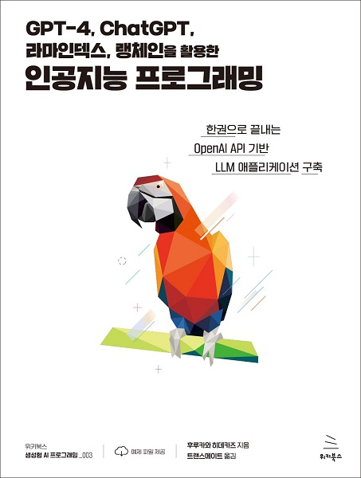

# GPT-4, ChatGPT, 라마인덱스, 랭체인을 활용한 인공지능 프로그래밍
### 한권으로 끝내는 OpenAI API 기반 LLM 애플리케이션 구축

- **후루카와 히데카즈** 지음 | **트랜스메이트** 옮김
- ISBN: 9791158394622
- 판형: 175*235*16mm
- 28,000원 | 2023년 9월 21일 발행 | 296쪽
- [책 홈페이지](https://wikibook.co.kr/openai-llm/)
- [도서 미리보기](https://www.yes24.com/Product/Viewer/Preview/122533123)
- [도서 관련 문의](https://wikibook.co.kr/support/contact/)

---

이 책은 OpenAI의 GPT 모델을 활용하여 채팅 AI를 개발하는 방법을 안내합니다. 파이썬의 기초 문법부터 라마인덱스를 활용한 파인튜닝 방법과 복잡한 작업을 수행하는 애플리케이션을 만들기 위한 랭체인 활용법까지 맞춤형 채팅 AI를 독자적인 시스템에 접목하는 방법을 단계별로 설명합니다.
 
**★ 이런 분께 추천합니다 ★**

- 채팅 AI의 작동 원리를 알고 싶은 분
- 채팅 AI에 지식과 계산 능력을 부여하여 업무를 자동화하고 싶은 분
- 대화 로봇이나 AITuber 등의 대화 엔진을 만들고 싶은 분
- 자신의 애플리케이션에 채팅 UI를 통합하고 싶은 분
 
**★ 이 책에서 배우는 내용 ★**

- ChatGPT, OpenAI 플레이그라운드, DALL-E 사용법
- OpenAI API를 활용한 텍스트 생성, 이미지 생성 방법
- 라마인덱스를 활용한 파인튜닝
- 랭체인의 기본 사용법과 고급 사례
- ChatGPT 플러그인 사용법 및 플러그인 제작 방법

---
 
 ## 구입처
 
 - [예스24](http://www.yes24.com/Product/Goods/122533123)
 - [교보문고](https://product.kyobobook.co.kr/detail/S000209182535)
 - [인터파크](http://book.interpark.com/product/BookDisplay.do?_method=detail&sc.prdNo=356801268)
 - [알라딘](https://www.aladin.co.kr/shop/wproduct.aspx?ItemId=324901870)